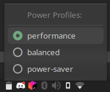

# power-profiles-applet



power-profiles-applet is a simple, gtk-based systray applet that lets
you check and change your current power profile (using [power-profiles-daemon](https://gitlab.freedesktop.org/hadess/power-profiles-daemon))

## Build:

This program is written in [Rust](https://www.rust-lang.org/). The Rust compiler can be installed by following the
instructions on the [official download page](https://www.rust-lang.org/tools/install).

Install `gtk-rs` by following the instructions
in [the book](https://gtk-rs.org/gtk4-rs/stable/latest/book/installation.html).

```shell
# Clone this repo
$ git clone https://github.com/edzdez/power-profiles-applet

# Build with cargo
$ cargo build --release
$ ./target/release/power-profiles-applet

# Alternatively, build and run in one step
$ cargo run --release
```
